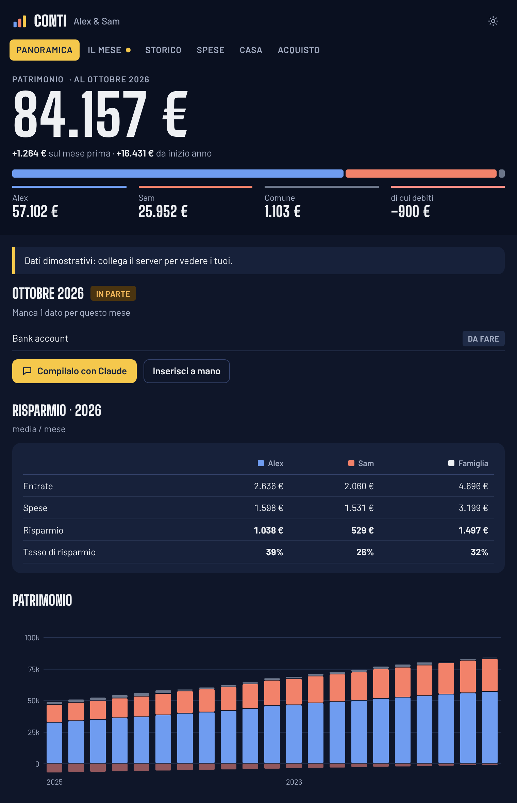

# Conti

**Le finanze di casa, una fotografia al mese. Una MCP App open source per Claude e per ogni host compatibile con MCP Apps.**

[English](README.md)

Conti tiene in ordine i soldi di casa senza collegare la banca e senza categorizzare movimenti. Una volta al mese mandi a Claude gli screenshot delle app della banca (o solo i numeri). Claude legge i saldi, li salva, e Conti ricava da soli quei dati:

- **Patrimonio** per persona e per la famiglia, al netto delle tasse sulle plusvalenze
- **Risparmio, spese e tasso di risparmio**, mese per mese e anno per anno
- **Obiettivi**: un obiettivo principale (fondo emergenze, casa, investire, estinguere un debito, un acquisto importante) con un traguardo facoltativo e il mese in cui lo raggiungi al ritmo attuale
- **Spese**: fisse e annuali, pianificato contro reale
- **Salute finanziaria**: tasso di risparmio, fondo emergenze, peso delle spese fisse, indebitamento, liquidità ferma, con la spiegazione di perché ognuno conta
- **Scenari di acquisto casa**: fondi propri, mutuo, rata a 20/25/30 anni rispetto a una quota sostenibile delle entrate, prezzo massimo, riserva che resta
- **"Posso permettermelo?"** e **"Quanto posso spendere?"** per qualsiasi acquisto: giudizio, motivi, costo del finanziamento e costo opportunità — oppure il budget in contanti e con il finanziamento

La dashboard compare **dentro la conversazione** (MCP Apps). E siccome Claude ha gli stessi numeri tramite i tool, domande come *"possiamo permetterci un bilocale da 300 mila euro?"* o *"perché quest'anno abbiamo risparmiato meno?"* ricevono risposte basate sui vostri dati reali. L'obiettivo è l'educazione finanziaria: capire i compromessi prima delle decisioni importanti.

> Conti fornisce informazioni, non consulenza finanziaria. Per le decisioni importanti confrontati con un professionista abilitato.



## Come funziona

- **Una fotografia al mese**: saldo di fine mese di ogni conto (più la plusvalenza latente per gli investimenti) ed entrate nette di ogni persona.
- **Risparmio = variazione del capitale investito** tra due mesi; **spese = entrate − risparmio**. Le plusvalenze non contano come risparmio, così l'andamento dei mercati non falsa il quadro.
- **Da 1 a N persone**: ogni conto appartiene a una o più persone con le loro quote, oppure è comune. Nei conti cointestati si possono registrare mese per mese i versamenti personali.
- **I dati restano tuoi**: un solo file SQLite sul tuo computer o sul tuo server. Nessuna telemetria, nessuna API di terzi.

## Installazione

Serve **Node.js 22.13 o superiore**.

### Opzione A: in locale (Claude Desktop, Claude Code)

I dati stanno in `~/.conti/conti.db` sul tuo computer.

**Claude Desktop**: Impostazioni → Sviluppatore → Modifica configurazione, poi aggiungi:

```json
{
  "mcpServers": {
    "conti": { "command": "npx", "args": ["-y", "conti-mcp"] }
  }
}
```

**Claude Code**:

```bash
claude mcp add conti -- npx -y conti-mcp
```

Riavvia il client e scrivi *"Configura Conti per me"*.

### Opzione B: il tuo server nel cloud (web, mobile e desktop, sempre sincronizzati)

Un server locale è raggiungibile solo da quel computer. Per usare Conti da claude.ai sul web, dalle app mobile e da Claude Desktop con **gli stessi dati sempre aggiornati**, fallo girare in HTTP su un server tuo e aggiungilo come connettore personalizzato.

```bash
# 1. genera un segreto
npx conti-mcp --new-token

# 2. avvialo (Docker, dati in un volume)
docker run -d --name conti -p 3333:3333 -v conti-data:/data \
  -e CONTI_TOKEN=<il-tuo-segreto> ghcr.io/<tu>/conti-mcp:latest
```

Mettilo dietro HTTPS (Fly.io, Railway, Render, una VPS con Caddy, oppure un server di casa con Cloudflare Tunnel), poi in Claude: **Personalizza → Connettori → + → Aggiungi connettore personalizzato** e incolla:

```
https://il-tuo-host.example.com/mcp/<il-tuo-segreto>
```

Una volta aggiunto è disponibile su claude.ai, nelle app mobile e in Claude Desktop. Guide passo passo: [docs/DEPLOY.md](docs/DEPLOY.md).

> Il segreto nell'URL è l'unica chiave per i tuoi dati: tratta l'URL come una password. Il supporto OAuth è in programma.

## Configurazione guidata e obiettivi

La prima volta scrivi *"Configura Conti per me"*. Claude ti accompagna in una configurazione breve e riprendibile. Non c'è nessuna spunta di "avanzamento" salvata: ogni passo è ricavato dai tuoi dati, così puoi fermarti e riprendere da qualsiasi dispositivo.

1. **Chi** c'è in famiglia
2. Il tuo **obiettivo principale** — capire le spese, fondo emergenze, comprare casa, investire, estinguere un debito o un acquisto importante
3. I tuoi **conti**
4. Le **entrate** del mese
5. La tua prima **dashboard**
6. *(facoltativo)* i **dettagli dell'obiettivo**: un importo e una data traguardo, oppure i conti che vi concorrono
7. *(facoltativo)* un **promemoria mensile** per aggiornare i numeri

L'**obiettivo principale** dà forma alla dashboard e al tono delle risposte di Claude. Conti riporta l'avanzamento di ogni obiettivo e, se imposti un traguardo, il mese in cui lo raggiungi al ritmo di risparmio attuale. Puoi cambiarlo quando vuoi: *"Rendi l'acquisto della casa il nostro obiettivo principale, traguardo 80.000 €"* oppure *"Quanto possiamo spendere per un'auto su 5 anni?"*.

I **moduli** facoltativi — investimenti, casa, debiti, spese fisse — si attivano da soli in base a obiettivi e dati; puoi forzarne qualcuno su on/off con `conti_update_settings`.

## La routine mensile

1. *"Facciamo settembre in Conti"*: Claude ti mostra cosa manca.
2. Mandagli gli screenshot di banca, broker e fondo pensione, e se vuoi la busta paga.
3. Claude legge i numeri, chiede se qualcosa non è chiaro, salva e ti mostra la dashboard.

Puoi anche inserire i numeri a mano nella scheda **Il mese** della dashboard.

## Strumenti

| Strumento | Cosa fa |
| --- | --- |
| `conti_dashboard` | Apre la dashboard interattiva (MCP App) |
| `conti_onboarding` | Il prossimo passo della configurazione guidata, ricavato dai dati (chi, obiettivo, conti, entrate, dashboard, poi dettagli obiettivo e promemoria facoltativi) |
| `conti_get_overview` | Riepilogo testuale: patrimonio, flussi, stato del mese, salute, spese, obiettivi |
| `conti_get_history` | Tabella mese per mese e riepiloghi annuali |
| `conti_health_check` | Indicatori con obiettivi e spiegazioni |
| `conti_setup` | Famiglia, persone, conti (idempotente) |
| `conti_upsert_account` / `conti_delete_account` / `conti_remove_member` | Gestione di conti e persone |
| `conti_set_goal` / `conti_delete_goal` | Imposta l'obiettivo principale (spese, fondo emergenze, casa, investire, debito, acquisto) con traguardo e conti collegati facoltativi |
| `conti_record_month` / `conti_delete_entries` | Salva o corregge saldi ed entrate di un mese |
| `conti_upsert_budget_item` / `conti_delete_budget_item` | Spese fisse mensili/annuali e risparmio pianificato |
| `conti_update_settings` | Tasse sulle plusvalenze, fondo emergenze, rata massima, moduli facoltativi, promemoria mensile, lingua, valuta |
| `conti_home_scenario` / `conti_delete_home_scenario` | Simulazione acquisto casa (apre la scheda Casa) |
| `conti_simulate_purchase` | "Posso permettermelo?" per un acquisto (apre la scheda Acquisto) |
| `conti_purchase_budget` | "Quanto posso spendere?" in contanti o con finanziamento (apre la scheda Acquisto) |
| `conti_export` / `conti_import` | Backup e ripristino JSON; importa anche i backup dell'artifact "Conti congiunti" |

## Arrivi dall'artifact "Conti congiunti"?

Dalla scheda Impostazioni dell'artifact esporta il JSON, poi chiedi a Claude: *"Importa questo backup in Conti"* e allega il file. Il tool `conti_import` riconosce il formato e lo converte: due persone, i loro conti, il conto comune con la quota personale, spese fisse, spese annuali, PAC e scenario casa.

## Sviluppo

```bash
npm install
npm test          # build + test unitari + test end-to-end (stdio e HTTP)
npm run preview   # host MCP Apps locale con dati dimostrativi su http://localhost:5174
```

Licenza [MIT](LICENSE).
