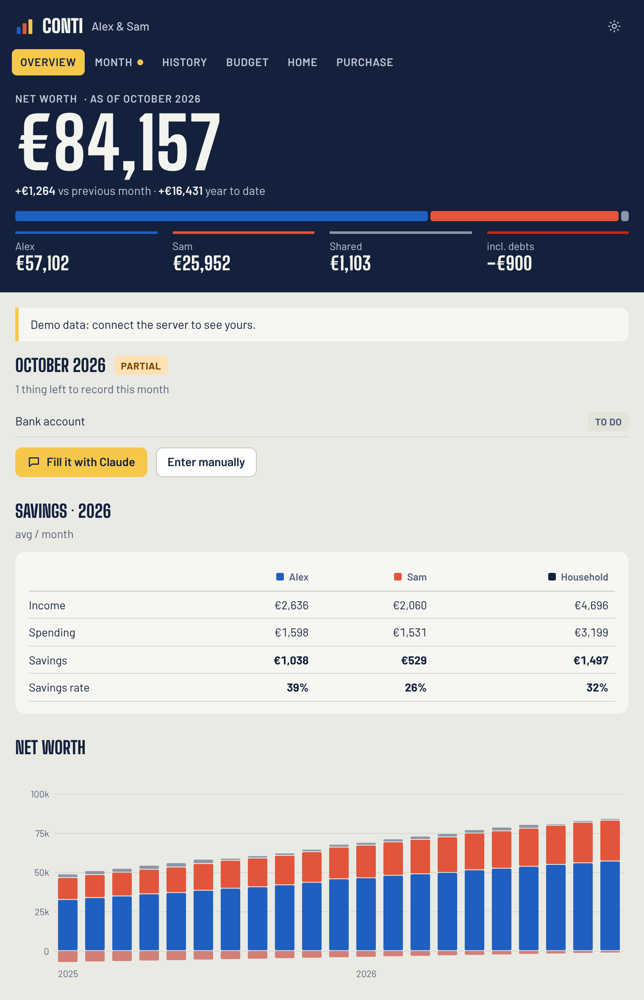

# Conti

**Household finances, one snapshot a month. An open-source MCP App for Claude and any MCP Apps host.**

[Italiano](README.it.md)

Conti keeps a household's money in order without bank connections or transaction categorisation. Once a month you send Claude screenshots of your banking apps (or just the numbers). Claude reads the balances, saves them, and from that alone Conti works out:

- **Net worth** per person and for the household, after tax on unrealized gains
- **Savings, spending and savings rate**, per month and per year
- **Budget**: fixed and yearly costs, planned vs. actual spending
- **Financial health**: savings rate, emergency fund, fixed-cost ratio, debt ratio, idle cash, with an explanation of why each one matters
- **Home purchase scenarios**: own funds, mortgage, payment at 20/25/30 years against a sustainable share of income, maximum affordable price, reserve left
- **"Can I afford it?"** for any purchase: verdict, reasons, loan cost, opportunity cost

The dashboard renders **inline in the conversation** (MCP Apps), and because Claude has the same numbers through tools, questions like *"can we afford a €300k flat?"* or *"why did we save less this year?"* get answers grounded in your real data. The aim is financial literacy: understanding the trade-offs before big decisions.

> Conti gives information, not financial advice. Check important decisions with a qualified professional.



## How it works

```
 you ──screenshots──▶ Claude ──conti_record_month──▶ Conti server ──▶ SQLite (yours)
                        ▲                                  │
                        └──── dashboard (MCP App), tools ◀─┘
```

- **One snapshot a month**: month-end balance of each account (plus unrealized gains for investments) and each person's net income.
- **Savings = change in invested capital** between two months; **spending = income − savings**. Gains don't count as savings, so market swings don't distort the picture.
- **1 to N people**: each account is owned by one or more people with shares, or shared by the household. Joint accounts can record personal deposits month by month.
- **Your data stays yours**: a single SQLite file on your computer or on your own server. No telemetry, no third-party APIs.

## Install

Requires **Node.js 22.13+**.

### Option A: local (Claude Desktop, Claude Code)

Your data lives in `~/.conti/conti.db` on your computer.

**Claude Desktop**: Settings → Developer → Edit config, then add:

```json
{
  "mcpServers": {
    "conti": { "command": "npx", "args": ["-y", "conti-mcp"] }
  }
}
```

**Claude Code**:

```bash
claude mcp add conti -- npx -y conti-mcp
```

Restart the client and say *"Set up Conti for me"*.

### Option B: your own cloud server (web, mobile and desktop, always in sync)

A local server is reachable only from that computer. To use Conti from claude.ai on the web, the mobile apps and Claude Desktop with **the same up-to-date data**, run it over HTTP on a server you control and add it as a custom connector.

```bash
# 1. generate a secret
npx conti-mcp --new-token

# 2. run it (Docker, data in a volume)
docker run -d --name conti -p 3333:3333 -v conti-data:/data \
  -e CONTI_TOKEN=<your-secret> ghcr.io/<you>/conti-mcp:latest
```

Put it behind HTTPS (Fly.io, Railway, Render, a VPS with Caddy, or a home server with a Cloudflare Tunnel), then in Claude: **Customize → Connectors → + → Add custom connector** and paste:

```
https://your-host.example.com/mcp/<your-secret>
```

Once added, it's available in claude.ai, the mobile apps and Claude Desktop. Step-by-step guides: [docs/DEPLOY.md](docs/DEPLOY.md).

> The secret in the URL is the only key to your data: treat the URL like a password. OAuth is on the roadmap.

## Monthly routine

1. *"Let's do September in Conti"*: Claude shows what's missing.
2. Send screenshots of your bank, broker and pension apps, and your payslip if you like.
3. Claude reads the numbers, asks about anything ambiguous, saves, and shows the dashboard.

You can also type the numbers into the **Month** tab of the dashboard.

## Tools

| Tool | What it does |
| --- | --- |
| `conti_dashboard` | Opens the interactive dashboard (MCP App) |
| `conti_get_overview` | Text summary: net worth, flows, this month's status, health, budget |
| `conti_get_history` | Month-by-month table and yearly summaries |
| `conti_health_check` | Metrics with targets and explanations |
| `conti_setup` | Household, people, accounts (idempotent) |
| `conti_upsert_account` / `conti_delete_account` / `conti_remove_member` | Manage accounts and people |
| `conti_record_month` / `conti_delete_entries` | Save or fix a month's balances and incomes |
| `conti_upsert_budget_item` / `conti_delete_budget_item` | Fixed monthly/yearly costs and planned savings |
| `conti_update_settings` | Tax on gains, emergency-fund target, max mortgage ratio, language, currency |
| `conti_home_scenario` / `conti_delete_home_scenario` | Home purchase simulation (opens the Home tab) |
| `conti_simulate_purchase` | "Can I afford it?" for any purchase (opens the Purchase tab) |
| `conti_export` / `conti_import` | JSON backup and restore; also imports backups from the original "Conti congiunti" Claude artifact |

## Configuration

| Flag / env | Default | |
| --- | --- | --- |
| `--db`, `CONTI_DB` | `~/.conti/conti.db` | SQLite file |
| `--http` | off | Streamable HTTP instead of stdio |
| `--port`, `PORT` | `3333` | HTTP port |
| `--host`, `HOST` | `127.0.0.1` | HTTP bind address (`0.0.0.0` in Docker) |
| `CONTI_TOKEN` | none | Secret required for any non-local HTTP bind |
| `CONTI_ALLOWED_HOSTS` | none | Comma-separated public hostnames (DNS-rebinding protection) |
| `--demo` | off | Fill an empty database with a fictional household |

## Development

```bash
npm install
npm test          # build + unit tests + end-to-end tests (stdio and HTTP)
npm run preview   # local MCP Apps host with demo data at http://localhost:5174
```

- `src/core`: pure calculation engine (`engine.ts`), data model, i18n, legacy importer
- `src/store`: SQLite persistence (`node:sqlite`, no native dependencies)
- `src/server`: MCP tools, UI resource, HTTP transport and auth
- `src/ui`: the dashboard, bundled into one HTML file served as `ui://conti/dashboard.html`

The engine is shared by the server and the UI, so what-if simulations recompute instantly in the browser and give the same numbers Claude sees.

Contributions are welcome: see [CONTRIBUTING.md](CONTRIBUTING.md). Good first areas: more languages and currencies, country-specific tax presets, OAuth for the HTTP mode, goals tracking.

## License

[MIT](LICENSE)
