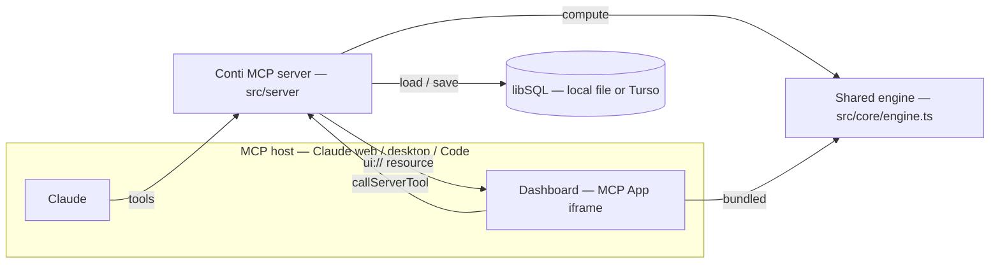
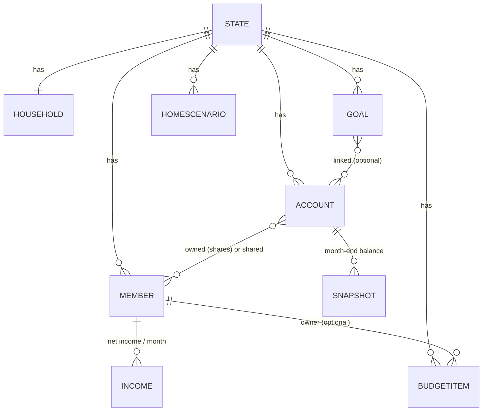

# Architecture

## Overview

Conti is a single MCP server that exposes household-finance tools to an MCP host (Claude) and hosts an interactive dashboard inline as an [MCP App](https://modelcontextprotocol.io). All calculations live in one pure engine shared by the server and the dashboard, so the model and the UI always agree on the numbers. Data is a single libSQL database — a local file or a remote Turso database — owned by the user.

## Components

| Component | Location | Purpose |
|-----------|----------|---------|
| Calculation engine | `src/core/engine.ts` | Pure functions: net worth, savings/spending, health checks, home and purchase simulations, goals, modules, onboarding. No I/O; unit-tested. |
| Data model | `src/core/types.ts` | `State` and its parts (household, members, accounts, snapshots, incomes, budget, goals, scenarios, settings). |
| i18n | `src/core/i18n.ts` | English + Italian strings and the money/percent/date formatters, shared by server text and UI. |
| Brand mark | `src/core/brand.ts` | The raccoon SVG used as the header logo, the favicon and the MCP server icon. |
| Store | `src/store/store.ts` | libSQL persistence (`@libsql/client`); one code path for a local file or a remote Turso database, with a write queue so concurrent clients don't race the revision counter. |
| Server | `src/server/server.ts` | Registers the MCP tools, the `ui://conti/dashboard.html` resource and the server identity (name, icon, website). |
| View model | `src/server/view.ts` | Serializable snapshot of the computed state for the dashboard. |
| HTTP transport | `src/server/http.ts` | Streamable HTTP for a personal cloud deployment, with token auth and the favicon routes. |
| Dashboard | `src/ui/app.ts`, `src/ui/index.html` | The MCP App, bundled into one HTML file; imports the engine so what-if inputs recompute in the browser. |

## Topology

The host runs both Claude and the dashboard iframe. Both reach the same server; the engine is shared on both sides.



## Monthly snapshot flow

Once a month the user sends balances and incomes; the model records them and shows the dashboard. Savings are derived, never imported.

```mermaid
sequenceDiagram
    actor User
    participant Claude
    participant Server as Conti MCP server
    participant Store as libSQL / Turso
    User->>Claude: screenshots of balances & payslip
    Claude->>Server: conti_record_month(month, balances, incomes)
    Server->>Store: upsert snapshots + incomes
    Store-->>Server: new revision
    Server-->>Claude: saved; what is still missing
    Claude->>Server: conti_dashboard
    Server-->>Claude: ui:// resource + overview text
    Claude-->>User: inline dashboard (MCP App)
```

## Data model

A single `State` aggregate holds everything. Accounts are owned by members with shares (or shared by the household); each month contributes one snapshot per account and one income per member.



## Key concepts

- **One engine, two callers.** `compute()` and the simulation helpers in `src/core/engine.ts` run unchanged on the server (for tool answers) and in the browser (for instant what-if recalculation). The dashboard does not depend on precomputed figures travelling in the view payload — it recomputes from `State`.
- **Savings measured, not categorised.** Savings for a month are the change in invested capital (`book`) between two snapshots; spending is income minus savings. Unrealized gains are excluded, so market swings don't distort the picture.
- **Ownership by shares.** Each account is attributed to members by share, with any remainder household-shared; a month's explicit allocations can override shares (e.g. personal deposits into a joint account).
- **Derived onboarding and modules.** `onboardingNext()` and `resolveModules()` read the current data rather than a saved progress flag, so a user can stop and resume from any device, and optional sections appear when they become relevant.
- **Privacy by construction.** The server makes no third-party calls; the dashboard loads nothing over the network except Google Fonts. The only credential for remote access is the token in the connector URL.

## Related documentation

- [Deployment](deploy.md) — running Conti for web, mobile and desktop.
- [README](../README.md) — install, tools and configuration.

---
**Last Updated:** October 2026
**Status:** Implemented
