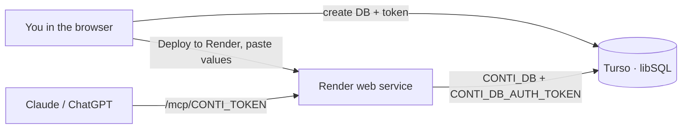

# Deployment

## Overview

claude.ai (web and mobile) connects to remote MCP servers **from Anthropic's cloud**, so for anything beyond a local setup the server must be reachable over public HTTPS. Each household runs **its own instance**: there is no central Conti server and nobody else holds the data. For the local, single-computer setup (Claude Desktop, Claude Code) see the [README](../README.md#install) instead.

Every remote option uses the same settings:

| Setting | Value |
|---------|-------|
| `CONTI_TOKEN` | a long random secret (`npx conti-mcp --new-token`); required for any non-local bind |
| `CONTI_DB` | libSQL database: a local file, a `file:` URL, or a Turso `libsql://…` URL |
| `CONTI_DB_AUTH_TOKEN` | auth token for a remote Turso database (also read from `TURSO_AUTH_TOKEN`) |
| Connector URL | `https://<your-host>/mcp/<CONTI_TOKEN>` |

In Claude: **Customize → Connectors → + → Add custom connector**, paste the URL. On Team/Enterprise an Owner adds it under **Organization settings → Connectors**. Clients that support headers (Claude Code, Claude Desktop, other MCP clients) can use `https://<your-host>/mcp` with an `Authorization: Bearer <CONTI_TOKEN>` header.

## Render + Turso (free, all from the browser)

The simplest self-hosted setup: data in Turso (managed libSQL), server on Render's free tier. No local tools, no credit card. One person sets this up once per household; everyone else just adds the connector URL.

1. **Turso — the database.** In the [Turso dashboard](https://turso.tech) create a database and a database token. Note the database URL (`libsql://conti-<you>.turso.io`) and the token.
2. **Render — the server.** Use the **Deploy to Render** button in the [README](../README.md), or Render → New → Blueprint → pick this repo. Render reads [`render.yaml`](../render.yaml) and prompts for `CONTI_DB` (the Turso URL) and `CONTI_DB_AUTH_TOKEN` (the Turso token). `CONTI_TOKEN` is generated automatically — read it back from the service's **Environment** tab.
3. **Connect.** Check that `https://<app>.onrender.com/health` returns `{"ok":true,…}`, then add the connector URL `https://<app>.onrender.com/mcp/<CONTI_TOKEN>` in Claude (or in ChatGPT under Developer Mode).

The free instance sleeps after ~15 min idle (first request wakes it in ~1 min); the data lives in Turso, so nothing is lost. For always-on, use a paid Render plan, Fly.io or Cloud Run — the same variables apply.

## Other hosts

Any host that runs the published Docker image over HTTPS works — Fly.io ([`fly.toml`](../fly.toml) is included), Railway, a VPS behind Caddy, or a home server exposed with a Cloudflare Tunnel. Set the same variables, mount a volume at `/data` when using a local `CONTI_DB` file (not needed with Turso), set `CONTI_ALLOWED_HOSTS` to your public hostname for DNS-rebinding protection, and point the connector at `/mcp/<CONTI_TOKEN>`.

## Backups and security

- **Backups.** `conti_export` returns a portable JSON copy at any time; with a local file the whole state is one database file you can copy. Turso keeps its own cloud backups. To migrate local → cloud, export locally and `conti_import` on the Turso-backed instance.
- **The token is the only credential.** Anyone with the connector URL can read and change the data — treat the URL like a password and rotate it by changing `CONTI_TOKEN` and re-adding the connector. Without a token the server refuses any non-local bind. The dashboard runs in the host's sandboxed iframe and makes no network requests except Google Fonts.

## Related documentation

- [Architecture](architecture.md) — components and data flow.
- [README](../README.md) — install, tools and configuration.

---
**Last Updated:** October 2026
**Status:** Implemented
