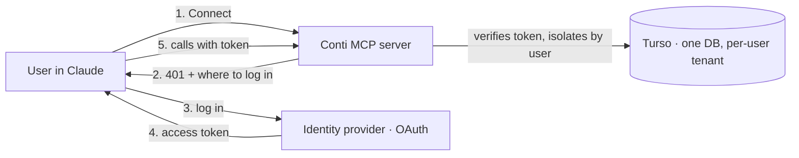
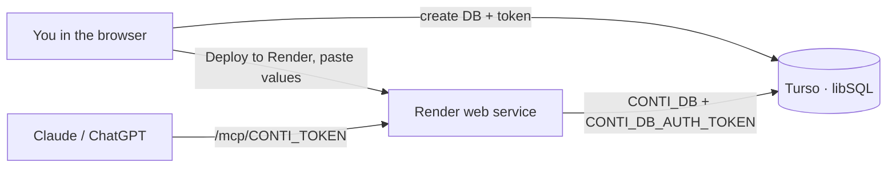

# Deployment

## Overview

claude.ai (web and mobile) connects to remote MCP servers **from Anthropic's cloud**, so for anything beyond a local setup the server must be reachable over public HTTPS. There are two ways to run it:

| Mode | Who it's for | Access |
|------|--------------|--------|
| **Hosted (OAuth)** | A non-technical end user: find the connector, click **Connect**, log in. No server to deploy, no secret to paste. One shared address; each user's data is isolated by their login. | OAuth 2.0 login |
| **Self-host (secret link)** | One household that wants to hold its own data. One person sets it up once; everyone else adds the URL. | `/mcp/<secret>` link |

For the local, single-computer setup (Claude Desktop, Claude Code) see the [README](../README.md#install) instead. The two modes coexist: a hosted server can keep a secret link active for the operator and testers while everyone else logs in with OAuth.

## Hosted (OAuth) — for everyone, including non-technical users

This is the setup that lets a non-technical person use Conti with **no technical steps**: they open Claude, pick Conti from the connector directory (or paste the one public URL), click **Connect**, and log in. Behind the scenes Claude discovers the login server from the connector, the user authenticates, and the server gives that user their own private space.

**What the operator sets up once** (you, not the end user):

1. **An identity provider (the Authorization Server).** Any OAuth 2.0 / OIDC provider that exposes `/.well-known/openid-configuration` and a JWKS endpoint, and that MCP clients can register with (Dynamic Client Registration + PKCE is what Claude expects). Hosted options in the EU keep data residency simple. You do **not** build a login system — Conti only *verifies* the tokens the provider issues.
2. **The server**, with these environment variables (see [`conti.env.example`](../conti.env.example)):

   | Variable | Value |
   |----------|-------|
   | `CONTI_OAUTH_ISSUER` | the provider's issuer URL (enables OAuth mode) |
   | `CONTI_PUBLIC_URL` | this server's public https URL, e.g. `https://conti.example.com` |
   | `CONTI_OAUTH_AUDIENCE` | expected token audience (defaults to `<CONTI_PUBLIC_URL>/mcp`) |
   | `CONTI_DB` / `CONTI_DB_AUTH_TOKEN` | the Turso database (one DB holds every user, isolated by tenant) |

   On start the server fetches the provider's metadata, so a wrong issuer fails fast. It then publishes its own discovery documents at `/.well-known/oauth-protected-resource/mcp` and `/.well-known/oauth-authorization-server`, and requires a valid login token on `/mcp`.
3. **Give users the address.** They add `https://conti.example.com/mcp` once (or find it in the directory) and log in. Each user (OAuth subject) gets a private tenant; nobody sees anyone else's numbers.

### Connector directory checklist

To list a hosted, authenticated connector in Claude's directory the server must meet these — all supported here:

- [x] **OAuth 2.0** authorization (`CONTI_OAUTH_ISSUER` set).
- [x] **HTTPS** everywhere (provided by the host platform / reverse proxy).
- [x] **`Origin` header validation** (enabled automatically; add trusted browser origins with `CONTI_ALLOWED_ORIGINS`).
- [x] **Tool annotations** declaring read-only / idempotent / destructive intent (every tool sets them).
- [x] A **"delete my data"** tool (`conti_delete_all`) and a privacy posture (below).

## Self-host (secret link) — Render + Turso, free, all from the browser

The simplest way for one household to hold its own data: data in Turso (managed libSQL), server on Render's free tier. No local tools, no credit card. One person sets this up once; everyone else just adds the connector URL.

| Setting | Value |
|---------|-------|
| `CONTI_TOKEN` | a long random secret (`npx conti-mcp --new-token`); required for any non-local bind |
| `CONTI_DB` | libSQL database: a local file, a `file:` URL, or a Turso `libsql://…` URL |
| `CONTI_DB_AUTH_TOKEN` | auth token for a remote Turso database (also read from `TURSO_AUTH_TOKEN`) |
| Connector URL | `https://<your-host>/mcp/<CONTI_TOKEN>` |

1. **Turso — the database.** In the [Turso dashboard](https://turso.tech) create a database and a database token. Note the database URL (`libsql://conti-<you>.turso.io`) and the token.
2. **Render — the server.** Use the **Deploy to Render** button in the [README](../README.md), or Render → New → Blueprint → pick this repo. Render reads [`render.yaml`](../render.yaml) and prompts for `CONTI_DB` and `CONTI_DB_AUTH_TOKEN`; it generates `CONTI_TOKEN` for you. Read it back from the service's **Environment** tab. (Generate your own URL-safe secret with `npx conti-mcp --new-token` if you prefer.)
3. **Connect.** Check that `https://<app>.onrender.com/health` returns `{"ok":true,…}`, then add `https://<app>.onrender.com/mcp/<CONTI_TOKEN>` in Claude (**Customize → Connectors → + → Add custom connector**) or in ChatGPT (Developer Mode). Clients that support headers can use `https://<app>.onrender.com/mcp` with `Authorization: Bearer <CONTI_TOKEN>`.

The free instance sleeps after ~15 min idle (first request wakes it in ~1 min); the data lives in Turso, so nothing is lost. For always-on, use a paid Render plan, Fly.io or Cloud Run — the same variables apply.

## Other hosts

Any host that runs the published Docker image over HTTPS works — Fly.io ([`fly.toml`](../fly.toml) is included), Railway, a VPS behind Caddy, or a home server exposed with a Cloudflare Tunnel. Set the same variables, mount a volume at `/data` when using a local `CONTI_DB` file (not needed with Turso), set `CONTI_ALLOWED_HOSTS` to your public hostname for DNS-rebinding protection, and point the connector at `/mcp/<CONTI_TOKEN>` (or enable OAuth as above).

## Privacy and data custody

Running the hosted mode makes you the custodian of other people's figures, so the design keeps that responsibility small:

- **Only user-declared numbers.** Conti stores account balances and net incomes the user types or pastes — **never bank credentials or live bank connections**.
- **Isolation.** One database, one tenant per authenticated user; a user's tools only ever read and write their own tenant (covered by tests).
- **Delete my data.** `conti_delete_all` erases a user's entire household on request; `conti_export` gives them a full copy first. Deletions and imports take an automatic server-side snapshot, so `conti_undo` can recover an accident — the snapshots are per-tenant too.
- **EU hosting & a privacy policy.** Host the server and the database in the EU and publish a short privacy policy (what is stored, where, how to delete it) before inviting non-testers.

## Backups and security

- **Backups.** `conti_export` returns a portable JSON copy at any time; with a local file the whole state is one database file you can copy. Turso keeps its own cloud backups. To migrate local → cloud, export locally and `conti_import` on the Turso-backed instance.
- **The secret link is a credential.** In secret-link mode anyone with the URL can read and change that data — treat the URL like a password and rotate it by changing `CONTI_TOKEN`. Generate it with `npx conti-mcp --new-token` so it is URL-safe. In OAuth mode there is no shared secret: access is per-user and revoked at the identity provider. The dashboard runs in the host's sandboxed iframe and makes no network requests except Google Fonts.

## Related documentation

- [Architecture](architecture.md) — components and data flow.
- [README](../README.md) — install, tools and configuration.

---
**Last Updated:** October 2026
**Status:** Implemented
